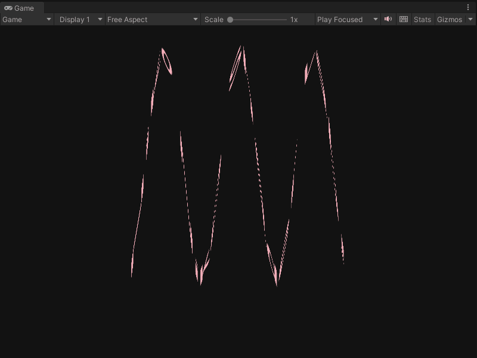
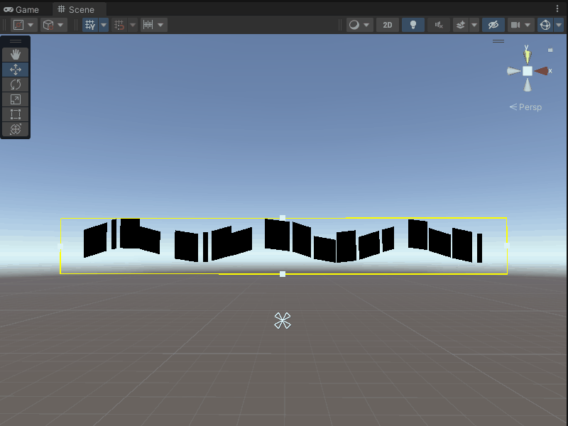
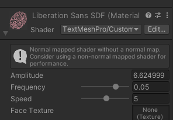
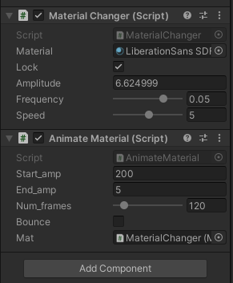

# Sine-Wave-Shader-for-Text-Mesh-Pro

Finally! A custom HLSL shader enabling sine wave animation for Unity UI text! Also includes a custom shader GUI and C# scripts for editing.

## What is this? Why is this?
This is a custom text mesh pro (TMP) vertex shader using HLSL that supports sine wave animation with customizable properties including amplitude, frequency, and animation speed. I made this shader to address the limitations of Unity’s default shaders that are incompatible with Unity UI text / TMP. 

### Limitations with Unity's default shaders

If you created a standard Unity vertex shader to animate vertices along a sine wave and placed that on Unity UI text / TMP text, the results would be a bunch of incorrectly renderered blocks. This is because TMP requires additional magic implemented in its shaders to render text, so creating and applying your own default shader is not enough. To get this working, I extended the functionality of existing TMP shaders by copying them and implementing the sine wave animation in the vertex shader.

## What features are included?
Default TMP shaders use a custom TMP Shader GUI that hides the shader properties that are exposed to Unity in the inspector. However, for this particular shader, we want to be able to modify frequency, amplitude, and speed from the inspector, so I also implemented a custom shader editor (in my Niko Niko namespace) using C# to enable editing of TMP shader properties from the Unity inspector. 

Alternatively, if you want to access the shader properties from a C# script, I implemented two scripts that do that. The first just allows you to edit the properties from the inspector, and the second is a fun animation script for demonstration purposes (used to create the gif above).

### Options
|Option 1: Edit Shader|Option 2: Edit Script|
|:--------:|:--------:|
|| |

Basically, you have options. If you want to edit using the shader material, you can do that. If you'd rather edit using the C# script, you can do that. However, if you edit one, you can't edit the other. If both are placed in your scene, the "Lock" boolean on the C# script determines whether you want to use the C# script (true) or the shader (false). If you want to include more animation effects like in the demo gif at the top, attach the animate script as well. 

## How to use
You must already have TextMesh Pro downloaded into your Unity project, and there should be a TextMesh Pro folder in your Assets folder. You may copy the Editor and Scripts folder from this repo into your Assets folder, and copy the shader files in this repo's TextMesh Pro folder into your project's TextMesh Pro folder. The custom TMP shaders must remain in the TextMesh Pro folder, and the custom shader GUI C# file must remain in the Editor folder. 

Then create some TMP text in your scene, find the shader component in the inspector, and select TextMesh Pro > one of the custom options. I recommend my Custom_TMP_SDF_SineWave shader, but I also included an inverse sine wave shader as well.

You may add the C# scripts to any active object in your Unity scene. I recommend creating an empty object to place the scripts on. Don't forget to reference the material from the TMP text in your scene in the insepctor for the C# script. It may be helpful to include two inspector windows for this.

## If you use...
Please fork this repo and show me what you make! I'd love to see somebody put this to use in a project!

## Credits
<ul>
  <li><a href="https://docs.unity3d.com/Packages/com.unity.textmeshpro@4.0/license/LICENSE.html">TextMesh Pro</a> copyright © 2022 Unity Technologies ApS</li>
</ul>
